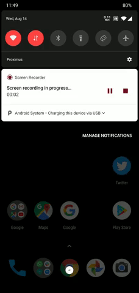

# Check your AndroidManifest.xml   

Check if you have the following in your `AndroidManifest.xml` file.  
You don't have to do anything else.    

```xml
<meta-data
    android:name="flutterEmbedding"
    android:value="2" />
```

Ideally you should have this, if not follow the [upgrade guide](https://github.com/flutter/flutter/wiki/Upgrading-pre-1.12-Android-projects).  
If for some reason you can't upgrade yet we still support the [older way of embedding](ANDROID_SETUP_V1.md):

# How to Debug my background job

Debugging a background task can be difficult, Android decides when is the best time to run.  
There is no guaranteed way to enforce a run of a job even in debug mode.  

However to facilitate debugging, the plugin provides an `isInDebugMode` flag when initializing the plugin: `Workmanager.initialize(callbackDispatcher, isInDebugMode: true)`  

Once this flag is enabled you will receive a notification whenever a background task was triggered.  
This way you can keep track whether that task ran successfully or not.  

  
