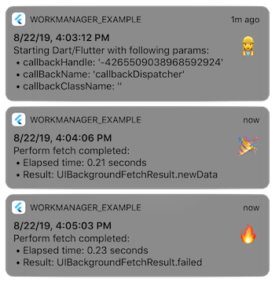

# iOS Installation

## Prerequisites

This plugin is compatible with **Swift 4.2** and up. Make sure you are using **Xcode 10.3** or higher and have set your minimum deployment target to **iOS 10** or higher by defining a platform version in your podfile: `platform :ios, '10.0'`


## Enable BGTaskScheduler

> ⚠️ BGTaskScheduler is similar to Background Fetch described below and brings a similar set of constraints. Most notably, there are no guarantees when the background task will be run. Excerpt from the documentation:
> 
> Schedule a processing task request to ask that the system launch your app when conditions are favorable for battery life to handle deferrable, longer-running processing, such as syncing, database maintenance, or similar tasks. The system will attempt to fulfill this request to the best of its ability within the next two days as long as the user has used your app within the past week.


This will add the **UIBackgroundModes** key to your project's `Info.plist`:

``` xml
<key>UIBackgroundModes</key>
<array>
	<string>processing</string>
</array>
```

You **MUST** amend your `AppDelegate.swift` and `Info.plist` file to register your task ID.

- AppDelegate.swift
``` swift
import workmanager
```

``` swift
// In AppDelegate.application method
WorkmanagerPlugin.registerTask(withIdentifier: "task-identifier")
```

- Info.plist
``` xml
<key>BGTaskSchedulerPermittedIdentifiers</key>
	<array>
		<string>task-identifier</string>
  </array>
```

And will set the correct *SystemCapabilities* for your target in the `project.pbxproj` file:

```
SystemCapabilities = {
	com.apple.BackgroundModes = {
		enabled = 1;
	};
};
```

## Testing BGTaskScheduler

Follow the instructions on https://developer.apple.com/documentation/backgroundtasks/starting_and_terminating_tasks_during_development.

The exact command to trigger the WorkManager default BG Task is:

```
e -l objc -- (void)[[BGTaskScheduler sharedScheduler] _simulateLaunchForTaskWithIdentifier:@"workmanager.background.task"]
```

## Enabling Background Fetch

> ⚠️ Background fetch is one supported way to do background work on iOS with work manager: **Periodic tasks** are available on Android only for now! (see #109)

Background fetching is very different compared to Android's Background Jobs.  
In order for your app to support Background Fetch, you have to add the *Background Modes* capability in Xcode for your app's Target and check *Background fetch*:


This will add the **UIBackgroundModes** key to your project's `Info.plist`:

```xml
<key>UIBackgroundModes</key>
<array>
	<string>fetch</string>
</array>
```

And will set the correct *SystemCapabilities* for your target in the `project.pbxproj` file:

```
SystemCapabilities = {
	com.apple.BackgroundModes = {
		enabled = 1;
	};
};
```

Inside your app's delegate `didFinishLaunchingWithOptions`, set your desired **minimumBackgroundFetchInterval** :


```Swift
class AppDelegate:UIResponder,UIApplicationDelegate{
    func application(_ application:UIApplication,didFinishLaunchingWithOptions launchOptions:[UIApplicationLaunchOptionsKey:Any]?)->Bool{
        // Other intialization code…
        UIApplication.shared.setMinimumBackgroundFetchInterval(TimeInterval(60*15))

        return true
    }
}
```

This ensures that the task is ran at most every 15 minutes.

> 📝 Note: this is a **minimum** time interval, there's no guarantee on how often this will be called.


## Testing Background Fetch

You can wait for iOS to trigger the `performFetchWithCompletionHandler` but you as a developer have no control over *when* and how often iOS will allow your app to fetch data in the background:

>  When a good opportunity arises, the system wakes or launches your app into the background and calls the app delegate’s `application:performFetchWithCompletionHandler:` method. [...] **Apps that download small amounts of content quickly, and accurately reflect when they had content available to download, are more likely to receive execution time in the future** than apps that take a long time to download their content or that claim content was available but then do not download anything.


> 📝 Note: also see relevant discussion in issue #23

But in order to test your implementation during development, you can *simulate* a `background fetch` in Xcode; go to `Debug` → `Simulate Background Fetch`


When the WorkManager plugin receives a `background fetch` event,  it will start a new **Dart isolate**, using the entrypoint provided by the `initialize` method.

Here is an example of a Flutter entrypoint called `callbackDispatcher`:

```dart
@pragma('vm:entry-point')
void callbackDispatcher() {
  Workmanager().executeTask((task, inputData) {
    switch (task) {
      case Workmanager.iOSBackgroundTask:
        stderr.writeln("The iOS background fetch was triggered");
        break;
    }
    bool success = true;
    return Future.value(success);
  });
}
```

If you then simulate a background fetch in Xcode, you should see  `"The iOS background fetch was triggered"` log in Xcode's Console:


### Troubleshooting

If the *Simulate Background Fetch* is greyed out in the *Debug* menu, that means Xcode's debugger is not attached to the current process. Attaching is done for you *automatically* when you run directly from Xcode. 

If you launched your app using the Flutter command line tools or another IDE like IntelliJ IDEA, you will need to attach to the running *Runner* process using the Debug menu in Xcode:


> 📝  Note that this feature of Xcode is not 100% reliable. For best results, run directly from Xcode


## Debug mode

To make background work more visible when developing, the WorkManager plugin provides an `isInDebugMode` flag when initializing the plugin:

```dart
Workmanager().initialize(callbackDispatcher, isInDebugMode: true)
```

If `isInDebugMode` is `true`, a local notification will be displayed whenever a background fetch was triggered by iOS. In the example gif below, two background fetches were *simulated* in quick succession. Both completing succesfully after a few seconds in this case:


These are the three notification types, **start** work, finished **successfully**, finished with **failure**:



*Success* or *failure* depending on what you return in Dart:

```dart
bool success = true;
return Future.value(success);
```


If your app is running in the **foreground**, notification banners are **not shown**. That is default behaviour on iOS. Triggering *Simulate Background Fetch* when running on a **real device** will put the app in the background *first*, before calling the `performFetchWithCompletionHandler`. This doesn't happen in the Simulator. So, make sure to go to the Home screen *before* triggering background fetch.

> 📝 Note: the Home Indicator swipe-up gesture is sometimes tricky to do on a simulator. Use Simulator menu  `Hardware` → `Home` or keyboard shortcut <kbd>⌘ command</kbd> + <kbd>⇧ shift</kbd> + <kbd>H</kbd> to make your life easier

### Show notifications in foreground

Alternatively, if you *do* want the banners to appear while your app is in the foreground you can implement `userNotificationCenter(_:willPresent:withCompletionHandler:)` of `UNUserNotificationCenterDelegate`.

From the [Apple docs](https://developer.apple.com/documentation/usernotifications/unusernotificationcenterdelegate/1649518-usernotificationcenter):

> If your **app is in the foreground** when a notification arrives, the shared user **notification center calls this method to deliver the notification directly to your app**. If you implement this method, you can take whatever actions are necessary to process the notification and update your app. When you finish, **call the completionHandler block and specify how you want the system to alert the user**, if at all.

An easy way to get it working is by implementing it your `AppDelegate` like so:
```swift
class AppDelegate: FlutterAppDelegate {
    // ...
    override func userNotificationCenter(_ center: UNUserNotificationCenter,
                                         willPresent notification: UNNotification,
                                         withCompletionHandler completionHandler: @escaping (UNNotificationPresentationOptions) -> Void) {
         completionHandler(.alert) // shows banner even if app is in foreground
     }
    
}
```

And assigning yourself as the delegate. Preferably as early as possible, in `application:didFinishLaunchingWithOptions:`

```swift
UNUserNotificationCenter.current().delegate = self
```

Now the banners **are** shown when your app is running in the foreground 👇


> 📝 Note: decide if implementing the delegate call makes sense for your app. You could make use of [active compilation conditions](https://blog.krzyzanowskim.com/2016/10/10/conditional-swift-testing/) to implement it *only* for the `Debug` configruation, for example


## Registered plugins
Since the provided Flutter entry point is ran in a dedicated **Dart isolate**, the Flutter plugins which may
have been registered AppDelegate's `didFinishLaunchingWithOptions` (or somewhere else) are unavailable,
since they were registered on a different registry.

In order to know when the Dart isolate has started, the plugin user may make use of the
WorkmanagerPlugin's `setPluginRegistrantCallback` function. For example :

```Swift
class AppDelegate: FlutterAppDelegate {
    /// Registers all pubspec-referenced Flutter plugins in the given registry.  
    static func registerPlugins(with registry: FlutterPluginRegistry) {
            GeneratedPluginRegistrant.register(with: registry)
       }
    
    override func application(_ application: UIApplication, didFinishLaunchingWithOptions launchOptions: [UIApplication.LaunchOptionsKey: Any]?) -> Bool {
        
        // ... Initialization code
        
        AppDelegate.registerPlugins(with: self) // Register the app's plugins in the context of a normal run
        
        WorkmanagerPlugin.setPluginRegistrantCallback { registry in  
            // The following code will be called upon WorkmanagerPlugin's registration.
            // Note : all of the app's plugins may not be required in this context ;
            // instead of using GeneratedPluginRegistrant.register(with: registry),
            // you may want to register only specific plugins.
            AppDelegate.registerPlugins(with: registry)
        }
    }
}
```


## Useful links

- [Updating Your App with Background App Refresh](https://developer.apple.com/documentation/uikit/app_and_environment/scenes/preparing_your_ui_to_run_in_the_background/updating_your_app_with_background_app_refresh) - Apple Documentation

- [UNUserNotificationCenterDelegate](https://developer.apple.com/documentation/usernotifications/unusernotificationcenterdelegate/1649518-usernotificationcenter) documentation
